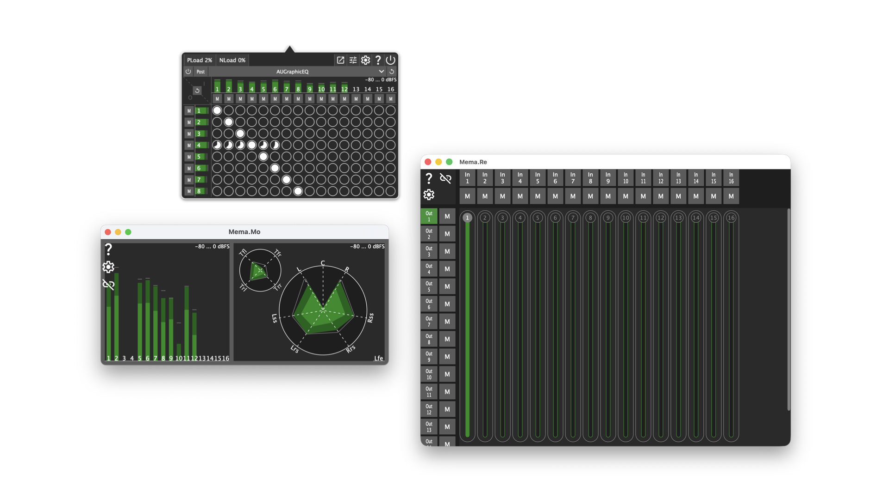

# Mema

Flexible audio matrix routing with per-channel metering, muting and crosspoint gain — controllable over the network from any connected device.

::: {.cta}
[Download latest release](https://github.com/ChristianAhrens/Mema/releases/latest)

[API Documentation](doxygen/)

[GitHub Repository](https://github.com/ChristianAhrens/Mema)
:::

---

## What it does

Mema is an audio matrix router that sits quietly in the macOS menubar or Windows notification area. It routes audio between any combination of system-visible input and output devices — including virtual drivers like [BlackHole](https://github.com/ExistentialAudio/BlackHole) — and gives full control over routing, gain and muting per channel without opening a DAW or configuring complex hardware.

The signal chain supports loading a third-party audio plug-in either before or after the routing matrix, covering use cases from per-input processing to full immersive upmixing. Two companion apps extend the tool over the local network: **Mema.Mo** for metering and visualisation and **Mema.Re** for remote control.

## Mema — the routing engine

Runs as a lightweight desktop app on macOS, Windows and Linux, or fully headless from the command line.

- N×M crosspoint routing matrix with per-crosspoint enable and gain
- Per-channel input and output muting
- VST, VST3, AU, LADSPA and LV2 plug-in host — insert pre-matrix or post-matrix
- Configurable audio device with sample rate and buffer size selection
- TCP server on port 55668 with multicast service announcement for automatic client discovery
- Dedicated performance metering for audio processing load and network traffic
- `--headless` mode with a fully interactive numbered CLI menu — no GUI required

## Mema.Mo — network level monitor

Connects to Mema over TCP and streams the audio data for local visualisation without adding any latency to the audio path.

- **Meterbridge** — per-channel peak, RMS and hold level meters
- **2D field** — spatial level display for immersive layouts from LRS to 9.1.6 Atmos
- **Waveform** — scrolling time-domain view across all active channels
- Discovers Mema instances automatically via multicast — no manual IP configuration needed
- Available for macOS, Windows, Linux and **iOS / iPadOS**

## Mema.Re — network remote control

Connects to the same TCP server as Mema.Mo and provides full control of the routing matrix from any device on the network.

- **Faderbank** — familiar mixer-style input × output crosspoint sliders and mutes
- **2D panning field** — interactive spatial panning for formats up to 9.1.6 Atmos
- **ADM-OSC** — accept x/y/z panning coordinates from external controllers over UDP and map them directly to the spatial control surface
- Available for macOS, Windows, Linux and **iOS / iPadOS**

## Use cases

### Studio rack monitoring

Route macOS system audio and DAW output through BlackHole into Mema, then feed a Raspberry Pi-based DIY rack panel running Mema.Mo. All channel metering is visible on a dedicated hardware display alongside the audio interface — no laptop screen required.

### Mobile recording monitoring

Mema on a MacBook, Mema.Mo on an iPad in Stage Manager mode: a large-format meter bridge on the same desk at no extra hardware cost.

### ADM-OSC driven immersive panning

Combine Mema, Mema.Mo and Mema.Re with any ADM-OSC source. Mema.Re translates incoming x/y/z position messages into real-time panning updates across a 9.1.6 ATMOS layout, with Mema.Mo providing a live spatial level overview alongside.

## Platform support

| | Mema | Mema.Mo | Mema.Re |
|:--|:--|:--|:--|
| macOS | Yes | Yes | Yes |
| Windows | Yes | Yes | Yes |
| Linux / Raspberry Pi | Yes | Yes | Yes |
| iOS / iPadOS | — | TestFlight | TestFlight |

## Get it

Binary packages for all platforms are attached to every [GitHub release](https://github.com/ChristianAhrens/Mema/releases/latest). iOS TestFlight betas for Mema.Mo and Mema.Re are linked from the [repository page](https://github.com/ChristianAhrens/Mema#readme).

Source code, build scripts and full technical documentation are in the [GitHub repository](https://github.com/ChristianAhrens/Mema). Code-level API documentation is in the [Doxygen reference](doxygen/).
