<center>
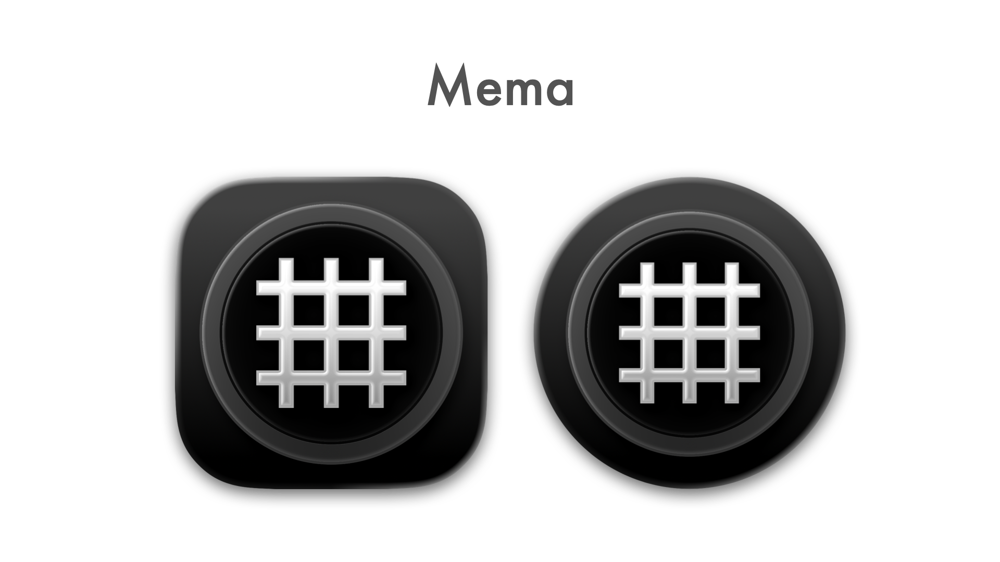
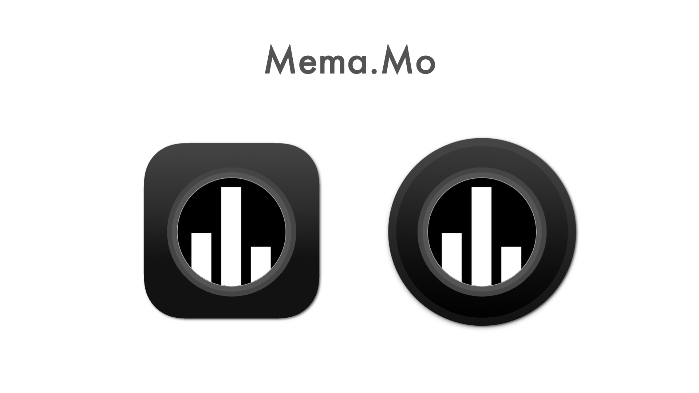
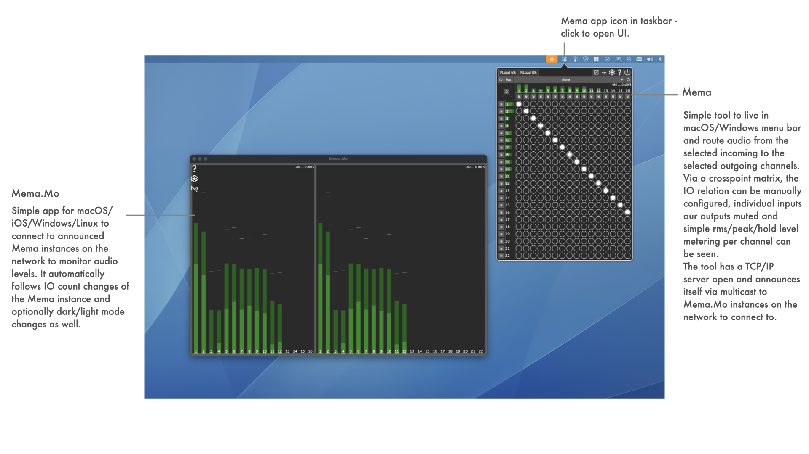
</center>

Full code documentation available at [](https://ChristianAhrens.github.io/Mema/)

See [LATEST RELEASE](https://github.com/ChristianAhrens/Mema/releases/latest) for available binary packages or join iOS TestFlight Betas:

|Mema.Mo Testflight|Mema.Re Testflight|
|:-----------------|:-----------------|
|  |  |


|Appveyor CI build status|Mema|Mema.Mo|Mema.Re|
|:----------------|:-----|:-----|:-----|
|macOS Xcode| [](https://ci.appveyor.com/project/ChristianAhrens/mema-macos) | [](https://ci.appveyor.com/project/ChristianAhrens/memamo-macos) | [](https://ci.appveyor.com/project/ChristianAhrens/memare-macos/branch/main) |
|Windows Visual Studio| [](https://ci.appveyor.com/project/ChristianAhrens/mema-windows) | [](https://ci.appveyor.com/project/ChristianAhrens/memamo-windows) | [](https://ci.appveyor.com/project/ChristianAhrens/memare-windows/branch/main) |
|Linux makefile| [](https://ci.appveyor.com/project/ChristianAhrens/mema-linux) | [](https://ci.appveyor.com/project/ChristianAhrens/memamo-linux) | [](https://ci.appveyor.com/project/ChristianAhrens/memare-linux/branch/main) |


<a name="toc" />

## Table of contents

* [Introduction](#introduction)
  * [Mema, Mema.Mo and Mema.Re](#MemaNMoNRe)
  * [Mema UI](#MemaUI)
    * [Mema UI plug-in signal chain](#MemaPluginSignalChain)
  * [Mema.Mo UI](#MemaMoUI)
  * [Mema.Re UI](#MemaReUI)
  * [Mema.Re ADM-OSC external control](#MemaReADMOSC)
* [Command-line parameters](#commandlineparameters)
  * [Mema headless CLI menu](#headlesscli)
* [How to build the tools](#howtobuild)
  * [Mema](#buildMema)
  * [Mema.Mo](#buildMemaMo)
  * [Mema.Re](#buildMemaRe)
  * [Note on running on RaspberryPiOS Bullseye](#runonbullseye)
* [Usecase: Studio sidecar monitoring](#rackmonitoringusecase)
* [Usecase: Mobile recording monitoring](#mobilerecordingusecase)
* [Usecase: ADM-OSC driven external panning control](#admoscusecase)
* [Architecture](#architecture)
  * [Architecture overview](#architectureoverview)
  * [Mema architecture](#memaarchitecture)
  * [Mema.Mo architecture](#memamoarchitecture)
  * [Mema.Re architecture](#memarearchitecture)


<a name="introduction" />

## Introduction

__Mema__ (MenubarMatrix) is a project initially created to try out JUCE C++ framework capabilities for creation of a macOS menubar tool, that provides audio matrix routing functionality - e.g. to route [BlackHole](https://github.com/ExistentialAudio/BlackHole) 16ch virtual device to system output to enable flexible application and OS audio output routing to connected audio devices.

The tool has since evolved to full IO metering, IO mute and crosspoint enabled/gain processing. The UI per default can be opened from the _macOS menubar_ or _Windows notifcation area_ and can be toggled to open as a standalone permanent OS window. The appearance can be customized (coloring, dark/light mode) and the audio UI device configuration can be configured to match the usecases needs.
On top of that, dedicated performance metering is visible on the UI - regaring audio processing load as well as regarding network traffic load for data transmission to connected metering and control clients.

Optionally the loading of an audio processing plug-in is supported to process the incoming audio before or after ('Post' UI toggle) it is fed into the routing matrix. Platform dependant, the usual __VST, VST3, AU, LADSPA, LV2__ plug-in formats are supported and their respective editor user interfaces can be used as a separate window.
_A usecase for this is an n-input to m-output upmix plug-in that, in combination with e.g. BlackHole, can serve to process stereo macOS system audio output to a 7.1.4 speaker system._

It is accompanied by a separate tool __Mema.Mo__ (MenubarMatrixMonitor) to monitor the audio IO as levelmeters via network. It connects to Mema through a TCP connection and supports discovering the available instances through a multicast service announcement done by Mema.
This supports different monitoring visualizations
- IO __Meterbridge__
- Studio speaker layout __2D field__ metering: LRS up to __9.1.6 ATMOS__ layouts
- __Waveform__ plot

Also part of the project is another tool __Mema.Re__ (MenubarMatrixRemote) to remote control the input, output and crosspoint parameters of Mema instances and connects through the same TCP server as Mema.Mo.
It supports two different control approaches
- __Faderbank__ mixer (single input to multiple output or multiple input to single output style)
- __2D field__ panning: LRS up to __9.1.6 ATMOS__ layouts

The sourcecode and prebuilt binaries are made publicly available to enable interested users to experiment, extend and create own adaptations.

Use what is provided here at your own risk!

<a name="MemaNMoNRe" />

### Mema, Mema.Mo and Mema.Re


<a name="MemaUI" />

### Mema UI details

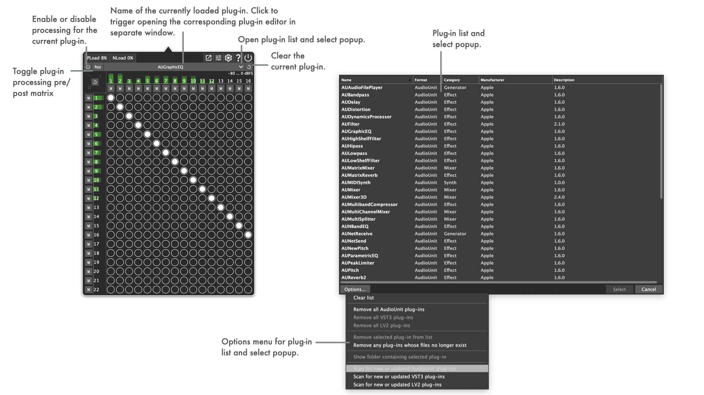

#### Mema UI plug-in handling details


<a name="MemaPluginSignalChain" />

#### Plug-in signal chain

The **`Post` toggle** in the plug-in section of the Mema UI controls where in the signal chain the loaded plug-in is inserted.

<table>
<tr>
<th>Pre-matrix &nbsp;—&nbsp; <code>Post</code> toggle <strong>OFF</strong></th>
<th>Post-matrix &nbsp;—&nbsp; <code>Post</code> toggle <strong>ON</strong></th>
</tr>
<tr>
<td>

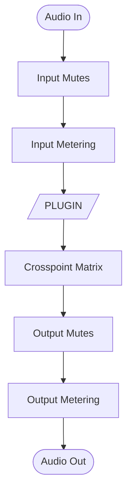
```mermaid
flowchart TD
    A([Audio In])
    B[Input Mutes]
    C[Input Metering]
    D[/PLUGIN/]
    E[Crosspoint Matrix]
    F[Output Mutes]
    G[Output Metering]
    H([Audio Out])

    A --> B --> C --> D --> E --> F --> G --> H
```

</td>
<td>

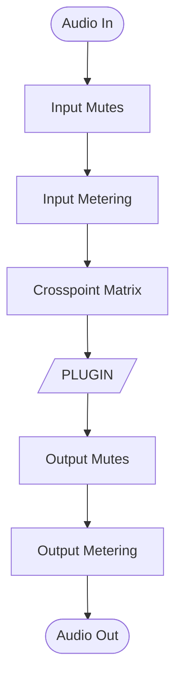
```mermaid
flowchart TD
    A([Audio In])
    B[Input Mutes]
    C[Input Metering]
    E[Crosspoint Matrix]
    D[/PLUGIN/]
    F[Output Mutes]
    G[Output Metering]
    H([Audio Out])

    A --> B --> C --> E --> D --> F --> G --> H
```

</td>
</tr>
<tr>
<td>The plug-in processes the raw (muted) input signal after input metering has captured the unprocessed levels. Its output feeds directly into the routing matrix, so all crosspoint gains and routes apply to the plug-in's output.<br><br><strong>Required channel count:</strong> number of active <em>input</em> channels.</td>
<td>The plug-in receives the fully routed and mixed signal after the crosspoint matrix. Output mutes and output metering are applied to the plug-in's output.<br><br><strong>Required channel count:</strong> number of active <em>output</em> channels.</td>
</tr>
</table>

A typical use-case for **Pre** is per-input processing (e.g. noise gate, EQ) before routing.
A typical use-case for **Post** is bus processing or upmixing (e.g. stereo → immersive) after routing.

<a name="MemaMoUI" />

### Mema.Mo UI details

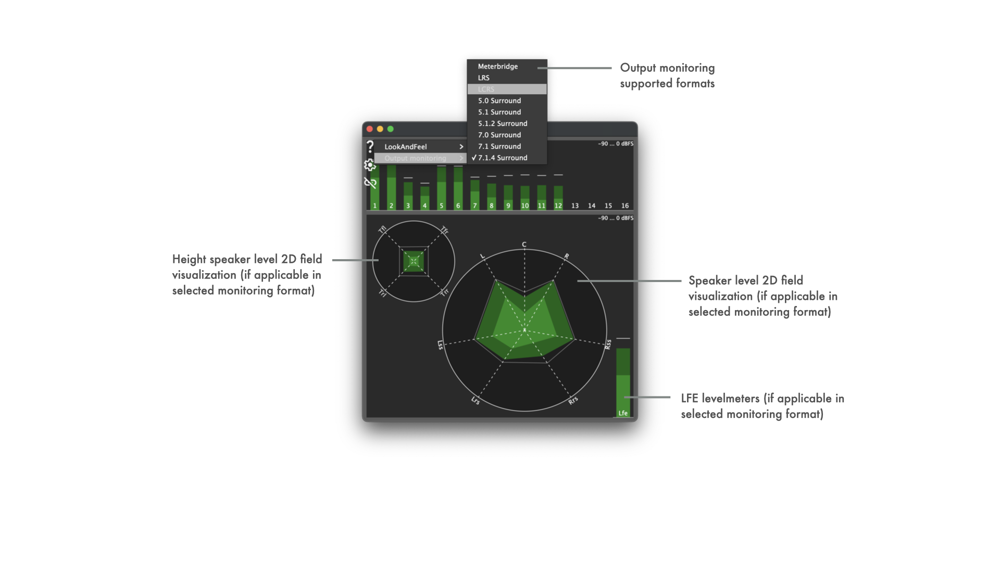

#### Mema.Mo UI output format visualization details

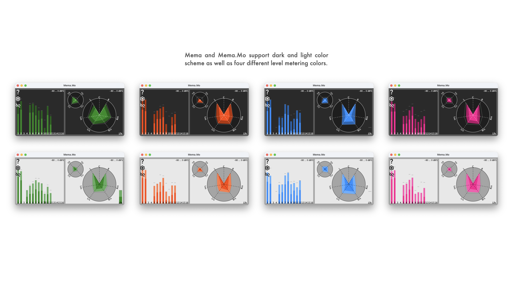

#### Mema.Mo UI waveforms visualization details


#### Supported UI coloring


<a name="MemaReUI" />

### Mema.Re UI details

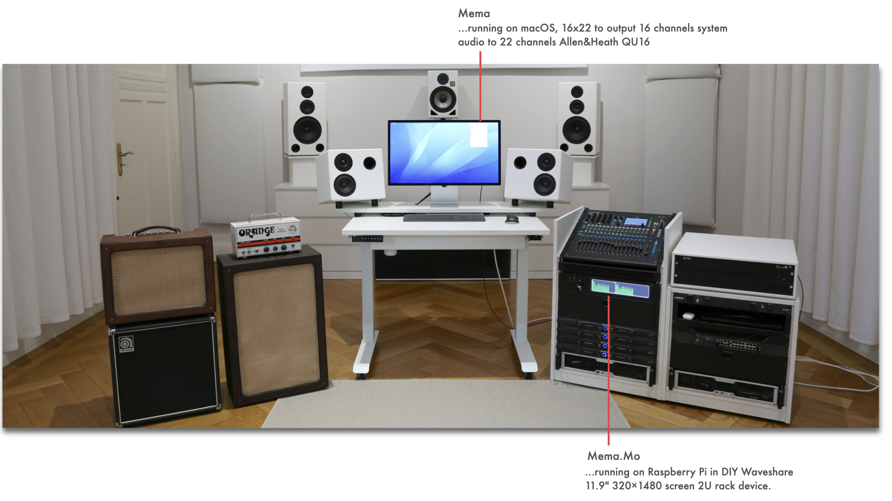

### Mema.Re UI 2D sound field panning details


<a name="MemaReADMOSC" />

### Mema.Re ADM-OSC external control

ADM-OSC external control is affecting the 2D soundfield panning function in Mema.Re.

_Currently only the cartesian coordinate control parameters are supported for panning control._

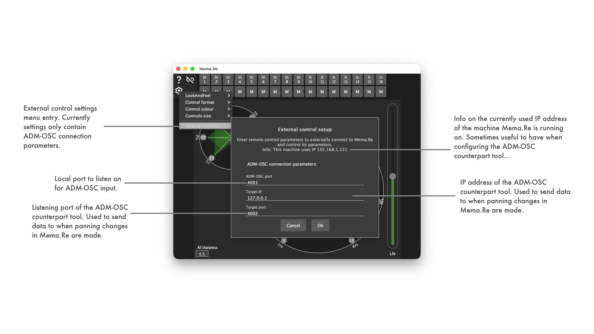

| Supported ADM-OSC parameter | address         | type  | range          | Info |
|:----------------------------|:----------------|:------|:---------------|:-----|
| x coordinate                | /adm/obj/n/x    | f     | -1.0f ... 1.0f | Horizontal panning position. |
| y coordinate                | /adm/obj/n/y    | f     | -1.0f ... 1.0f | Vertical panning position. |
| z coordinate                | /adm/obj/n/z    | f     | -1.0f ... 1.0f | Panning layer definition. Relevant for panning formats with a height layer, e.g. 5.1.2, 7.1.4, 9.1.6. Values above 0.5 are associated with height elevated outputs, values below with regular positioned outputs. |
| xy coordinate               | /adm/obj/n/xy   | f f   | -1.0f ... 1.0f | Combined horizontal and vertical panning position. |
| xyz coordinate              | /adm/obj/n/xyz  | f f f | -1.0f ... 1.0f | Combined horizontal and vertical panning position and height layer association. |
| width                       | /adm/obj/n/w    | f     | 0.0f ... 1.0f  | Associated with panning sharpness value. |
| mute                        | /adm/obj/n/mute | i     | 0 ... 1        | Input mute. |


<a name="commandlineparameters" />

## Command-line parameters

All three applications (Mema, Mema.Mo, Mema.Re) share a common set of command-line parameters. Parameters are passed directly when launching the executable from a terminal or as part of a launch script.

| Parameter | Applies to | Description |
|:----------|:-----------|:------------|
| `--headless` | Mema only | Launches Mema without a graphical user interface. Activates an interactive, numbered CLI menu for full configuration of input/output mutes, crosspoint matrix gains, audio device setup, and config file load/save. On Windows, a console window is attached (or created) automatically. |
| `--noupdates` | Mema, Mema.Mo, Mema.Re | Disables the automatic online update check performed by `JUCEAppBasics::WebUpdateDetector` at startup. Useful in network-restricted environments, automated deployments, or kiosk setups where outbound HTTP requests to GitHub should be avoided. |
| `--noconfigui` | Mema.Mo, Mema.Re | Hides the three configuration buttons (About, Settings, Disconnect) in the upper-left corner of the UI. Intended for kiosk or embedded deployments where the user should not be able to change settings or disconnect from the Mema server. |

<a name="headlesscli" />

### Mema headless CLI menu

When Mema is started with `--headless` a fully interactive, numbered menu is printed to the terminal. No graphical window is opened. On Windows, Mema attaches to the parent console automatically (or opens a new one if launched outside a terminal).

The menu is organised as a tree of numbered sub-menus. At every level, pressing `b` returns to the previous menu and `q` quits the application.

```
Main menu
├── 1  Input mutes      — list all active input channels; enter a number to toggle mute
├── 2  Output mutes     — list all active output channels; enter a number to toggle mute
├── 3  Matrix gains     — view the routing matrix grid ('+' enabled, '.' disabled)
│                          enter "in out" (e.g. "2 3") to select a crosspoint, then:
│                            t  toggle enable/disable
│                            g  set gain in dB
│                            b  back to matrix overview
├── 4  Audio device     — show current device, driver, sample rate, buffer size, channel counts
│                          sub-options:
│                            1  select input device  (lists all available devices by type)
│                            2  select output device (lists all available devices by type)
│                            3  select sample rate   (lists rates reported by device)
│                            4  select buffer size   (lists sizes reported by device)
│                            b  back to main menu
├── 5  Load config      — type a file path to load a .config XML file from disk
├── 6  Save config      — type a file path to write the current configuration to disk
└── q  Quit             — request application shutdown
```

The main menu shows a live status summary next to each item (e.g. number of muted channels, current device name and sample rate) so the current state is always visible without entering a sub-menu.

**Examples**

```sh
# Launch Mema in headless mode (no GUI, interactive CLI):
./Mema --headless

# Launch Mema without the automatic update check:
./Mema --noupdates

# Combine both flags:
./Mema --headless --noupdates

# Launch Mema.Mo without the automatic update check:
./MemaMo --noupdates

# Launch Mema.Re without the automatic update check:
./MemaRe --noupdates

# Launch Mema.Mo in kiosk mode (no config buttons, no update check):
./MemaMo --noconfigui --noupdates

# Launch Mema.Re in kiosk mode (no config buttons, no update check):
./MemaRe --noconfigui --noupdates
```


<a name="howtobuild" />

## How to build the tools

Mema and Mema.Mo are based on JUCE C++ framework, which is a submodule of this repository.

JUCE's Projucer tool can either be used from a local installation or from within the submodule (submodules/JUCE/extras/Projucer).

<a name="buildMema" />

### Mema

[Mema Projucer project](Mema.jucer) file can be found in repository root directory.

In [macOS buildscripts](Resources/Deployment/macOS), shellscripts for automated building of the app, dmg and notarization are kept. These require a properly prepared machine to run on (signing certificates, provisioning profiles, notarization cretentials).

In [Windows buildscripts](Resources/Deployment/Windows), bash scripts for automated building of the app and installer (Innosetup based) are kept. These require a properly prepared machine to run on (innosetup installation).

In [Linux buildscripts](Resources/Deployment/Linux), shell scripts for automated building of the app are kept. These are aimed at building on Debian/Ubuntu/RaspberryPiOS and TRY to collect the required dev packages via apt packetmanager automatically.

<a name="buildMemaMo" />

### Mema.Mo

[Mema.Mo Projucer project](MemaMo/MemaMo.jucer) file can be found in /MemaMo subdirectory .

In [macOS buildscripts](Resources/Deployment/macOS), shellscripts for automated building of the app, dmg and notarization are kept. These require a properly prepared machine to run on (signing certificates, provisioning profiles, notarization cretentials).

In [iOS buildscripts](Resources/Deployment/iOS), shellscripts for automated building of the app and updloading to the appstore are kept. These require a properly prepared machine to run on (appstore cretentials).

In [Windows buildscripts](Resources/Deployment/Windows), bash scripts for automated building of the app and installer (Innosetup based) are kept. These require a properly prepared machine to run on (innosetup installation).

In [Linux buildscripts](Resources/Deployment/Linux), shell scripts for automated building of the app are kept. These are aimed at building on Debian/Ubuntu/RaspberryPiOS and TRY to collect the required dev packages via apt packetmanager automatically.

<a name="buildMemaRe" />

### Mema.Re

[Mema.Re Projucer project](MemaRe/MemaRe.jucer) file can be found in /MemaRe subdirectory .

In [macOS buildscripts](Resources/Deployment/macOS), shellscripts for automated building of the app, dmg and notarization are kept. These require a properly prepared machine to run on (signing certificates, provisioning profiles, notarization cretentials).

In [iOS buildscripts](Resources/Deployment/iOS), shellscripts for automated building of the app and updloading to the appstore are kept. These require a properly prepared machine to run on (appstore cretentials).

In [Windows buildscripts](Resources/Deployment/Windows), bash scripts for automated building of the app and installer (Innosetup based) are kept. These require a properly prepared machine to run on (innosetup installation).

In [Linux buildscripts](Resources/Deployment/Linux), shell scripts for automated building of the app are kept. These are aimed at building on Debian/Ubuntu/RaspberryPiOS and TRY to collect the required dev packages via apt packetmanager automatically.

<a name="runonbullseye" />

### Building and running Mema.Mo and Mema.Re on RaspberryPiOS Bullseye/Bookworm

The build scripts `build_MemaMo_RaspberryPIOS.sh`/`build_MemaRe_RaspberryPIOS.sh` in `Resources/Deployment/Linux` can be used on a vanilla installation of RaspberryPi OS to build the tool.

On RaspberriPi 3B it is required to run the build without graphical interface, to avoid the build failing due to going out of memory (e.g. `sudo raspi-config` -> System Options -> Boot -> Console Autologin).

The build result can be run in kind of a kiosk configuration by changing the system to not start the desktop session when running Xserver, but instead run Mema.Mo/Mema.Re directly in the X session. To do this, edit or create `.xsession` in user home and simply add a line
```
exec <PATH_TO_REPO>/Mema/MemaMo/Builds/LinuxMakefile/build/MemaMo
# or
exec <PATH_TO_REPO>/Mema/MemaRe/Builds/LinuxMakefile/build/MemaRe
```
Then configure the system to auto login to x session (e.g. `sudo raspi-config` -> System Options -> Boot -> Desktop Autologin).

___This does only work when using X server as graphics backend. Using Wayland requires differing approaches.___

<a name="rackmonitoringusecase" />

## Usecase: Studio rack monitoring


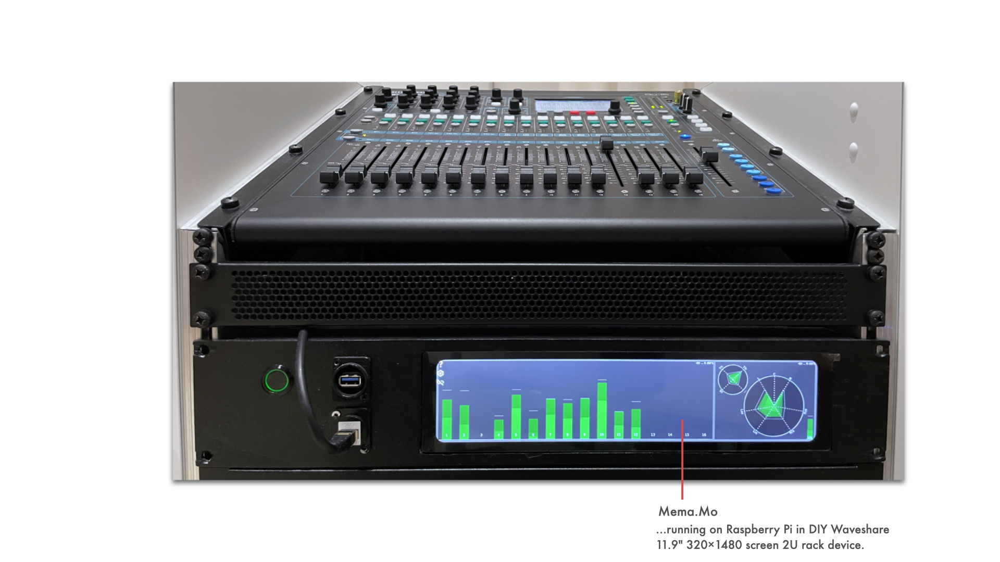

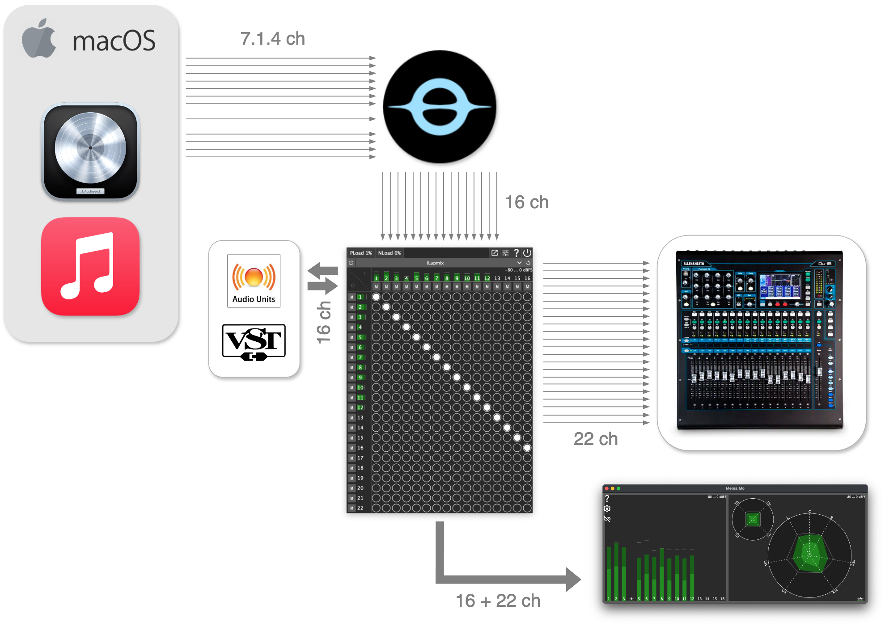

* Mema on macOS
  * BlackHole 16ch used to route signal from LogicPro, Apple Music, etc. to Mema
  * Output to Allen&Heath QU-16 22ch audio driver interface
* Mema.Mo on DIY 19" rack display, based on RaspberryPi (32bit RaspberryPiOS, Bullseye)
  * 16 audio input channel metering visible
  * 22 audio output channel metering visible


<a name="mobilerecordingusecase" />

## Usecase: Mobile recording monitoring

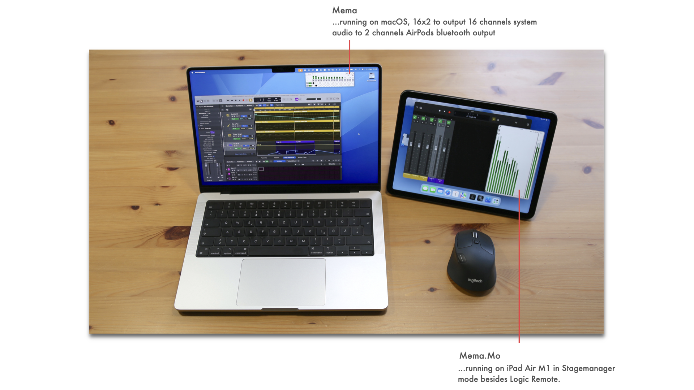

* Mema on macOS
  * BlackHole 16ch used to route signal from LogicPro, Apple Music, etc. to Mema
  * Output to stereo audio driver interface
* Mema.Mo on iPadOS in Stagemanager mode
  * 16 audio input channel metering visible
  * 2 audio output channel metering visible


<a name="admoscusecase" />

## Usecase: ADM-OSC driven external panning control

[](https://youtu.be/5jSxzoz1hE0)

* Mema on macOS
  * BlackHole 16ch used to route signal from macOS to Mema
  * Output to multichannel interface, driving a 9.1.6 ATMOS immersive speaker setup
* Mema.Mo on macOS
  * Meterbridge mode
  * 16 audio input channel metering visible
  * 16 audio output channel metering visible
* Mema.Re on macOS
  * 9.1.6 panning layout active
  * 16 input panning positions visible, 1-4 active in regular panning layer, 5-6 active in height panning layer
* Grapes on macOS
  * Set up to control panning positions in Mema.Re via ADM-OSC
  * Clips 1-4 configured to control ADM-OSC objects 1-4 with Z=0 -> Mema.Re regular panning layer
  * Clips 5-6 configured to control ADM-OSC objects 5-6 with Z=1 -> Mema.Re height panning layer


<a name="architecture" />

## Architecture

<a name="architectureoverview" />

### Architecture overview - Mema, Mema.Mo, Mema.Re interaction/interconnection

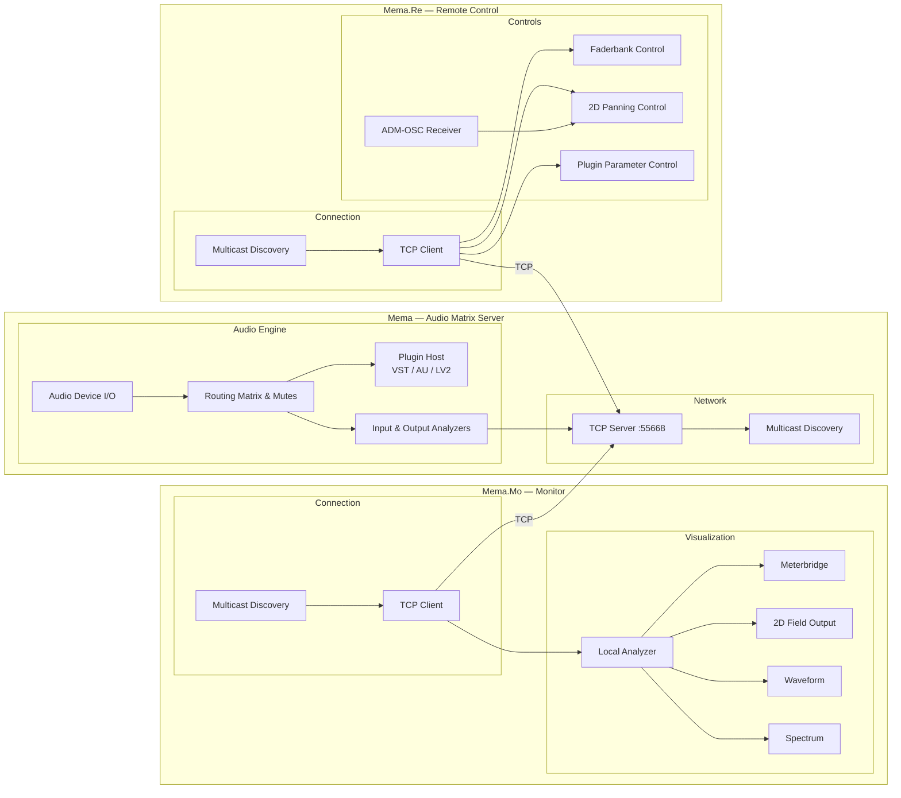
```mermaid
flowchart LR
    subgraph mema["Mema — Audio Matrix Server"]
        subgraph mema_audio["Audio Engine"]
            audio_dev["Audio Device I/O"]
            matrix["Routing Matrix & Mutes"]
            pluginhost["Plugin Host\nVST / AU / LV2"]
            analyzers["Input & Output Analyzers"]
        end
        subgraph mema_net["Network"]
            tcp_srv["TCP Server :55668"]
            svc_srv["Multicast Discovery"]
        end
    end

    subgraph memo["Mema.Mo — Monitor"]
        subgraph memo_net["Connection"]
            mo_disc["Multicast Discovery"]
            mo_sock["TCP Client"]
        end
        subgraph memo_viz["Visualization"]
            mo_anlz["Local Analyzer"]
            mo_meter["Meterbridge"]
            mo_2d["2D Field Output"]
            mo_wave["Waveform"]
            mo_spect["Spectrum"]
        end
    end

    subgraph mere["Mema.Re — Remote Control"]
        subgraph mere_net["Connection"]
            re_disc["Multicast Discovery"]
            re_sock["TCP Client"]
        end
        subgraph mere_ctrl["Controls"]
            re_fader["Faderbank Control"]
            re_pan["2D Panning Control"]
            re_plugin["Plugin Parameter Control"]
            re_osc["ADM-OSC Receiver"]
        end
    end

    audio_dev --> matrix
    matrix --> pluginhost
    matrix --> analyzers
    analyzers --> tcp_srv
    tcp_srv --> svc_srv

    mo_disc --> mo_sock
    mo_sock --> mo_anlz
    mo_anlz --> mo_meter
    mo_anlz --> mo_2d
    mo_anlz --> mo_wave
    mo_anlz --> mo_spect

    re_disc --> re_sock
    re_sock --> re_fader
    re_sock --> re_pan
    re_sock --> re_plugin
    re_osc --> re_pan

    mo_sock -- TCP --> tcp_srv
    re_sock -- TCP --> tcp_srv
```

**Mema** is the core tool, providing matrix processing, a popup-style UI and tcp server for clients to connect and monitor/control data:
- `MemaProcessor` drives audio I/O via JUCE `AudioDeviceManager`; the per-block signal chain is: **Input Mutes → Input Metering → [Plugin, pre-matrix] → Crosspoint Matrix → [Plugin, post-matrix] → Output Mutes → Output Metering** — only one plugin position is active at a time, selected by the `Post` toggle
- An optional plugin (VST/VST3/AU/LADSPA/LV2) can be inserted pre- or post-matrix; each plugin parameter can be individually marked as remotely controllable with a configurable control type (`Continuous`, `Discrete`, `Toggle`)
- `ProcessorDataAnalyzer` (one per direction) performs peak/RMS/hold metering and FFT spectrum analysis at ~10 ms intervals
- `InterprocessConnectionServerImpl` serves multiple simultaneous TCP clients on port 55668; `ServiceTopologyManager` announces the server via multicast
- Network protocol messages include: `ControlParametersMessage`, `AudioInputBufferMessage`/`AudioOutputBufferMessage`, `PluginParameterInfosMessage`, `PluginParameterValueMessage`

**Mema.Mo** is the monitoring client:
- Discovers Mema via multicast and opens a persistent TCP socket to receive streaming audio output buffers
- Received buffers are fed into a local `ProcessorDataAnalyzer` replica for level and spectrum computation
- Four pluggable visualization components subscribe to the analyzer: `MeterbridgeComponent`, `TwoDFieldOutputComponent` (LRS up to 9.1.6 ATMOS layouts), `WaveformAudioComponent`, and `SpectrumAudioComponent`

**Mema.Re** is the remote control client:
- Discovers Mema via multicast and opens a persistent TCP socket
- Receives a full `ControlParametersMessage` state snapshot on connect, then sends updated snapshots on user interaction
- Three control modes: `FaderbankControlComponent` (input×output crosspoint sliders/mutes), `PanningControlComponent` (interactive 2D spatial field backed by `TwoDFieldMultisliderComponent`), and `PluginControlComponent` (per-parameter controls rendered dynamically as slider, combo box, or toggle button based on `ParameterControlType`)
- `ADMOSController` listens for ADM-OSC UDP packets (x/y/z/width/mute per object) and feeds them directly into the panning control

<a name="memaarchitecture" />

### Mema — Internal Architecture

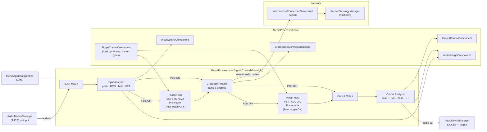
```mermaid
flowchart LR
    adm_in["AudioDeviceManager\n(JUCE) — input"]
    adm_out["AudioDeviceManager\n(JUCE) — output"]
    cfg["MemaAppConfiguration\n(XML)"]

    subgraph proc["MemaProcessor — Signal Chain (left to right)"]
        in_mutes["Input Mutes"]
        in_anlz["Input Analyzer\npeak · RMS · hold · FFT"]
        plugin_pre["Plugin Host\nVST / AU / LV2\nPre-matrix\n(Post toggle OFF)"]
        xp["Crosspoint Matrix\ngains & enables"]
        plugin_post["Plugin Host\nVST / AU / LV2\nPost-matrix\n(Post toggle ON)"]
        out_mutes["Output Mutes"]
        out_anlz["Output Analyzer\npeak · RMS · hold · FFT"]
    end

    subgraph ui["MemaProcessorEditor"]
        in_ctrl["InputControlComponent"]
        xp_ctrl["CrosspointsControlComponent"]
        out_ctrl["OutputControlComponent"]
        plug_ctrl["PluginControlComponent\n(load · pre/post · param types)"]
        meter["MeterbridgeComponent"]
    end

    subgraph net["Network"]
        tcp["InterprocessConnectionServerImpl\n:55668"]
        disc["ServiceTopologyManager\n(multicast)"]
    end

    adm_in -->|audio in| in_mutes
    in_mutes --> in_anlz
    in_anlz -->|Post OFF| plugin_pre --> xp
    in_anlz -->|Post ON| xp
    xp -->|Post ON| plugin_post --> out_mutes
    xp -->|Post OFF| out_mutes
    out_mutes --> out_anlz
    out_anlz -->|audio out| adm_out

    in_anlz --> in_ctrl
    in_anlz --> meter
    out_anlz --> out_ctrl
    out_anlz --> meter
    xp --> xp_ctrl
    plug_ctrl --> plugin_pre
    plug_ctrl --> plugin_post

    xp -->|state & audio buffers| tcp
    tcp --> disc

    cfg -.- proc
```

<a name="memamoarchitecture" />

### Mema.Mo — Internal Architecture

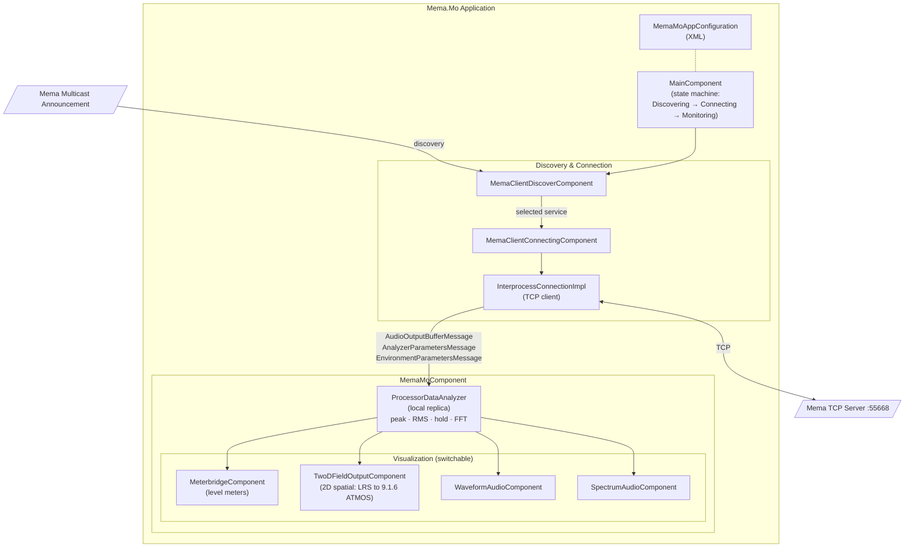
```mermaid
flowchart TD
    multicast[/"Mema Multicast Announcement"/]
    mema_srv[/"Mema TCP Server :55668"/]

    subgraph app["Mema.Mo Application"]
        cfg["MemaMoAppConfiguration\n(XML)"]
        main["MainComponent\n(state machine:\nDiscovering → Connecting → Monitoring)"]

        subgraph connection["Discovery & Connection"]
            disc_comp["MemaClientDiscoverComponent"]
            conn_comp["MemaClientConnectingComponent"]
            sock["InterprocessConnectionImpl\n(TCP client)"]
        end

        subgraph monitor["MemaMoComponent"]
            anlz["ProcessorDataAnalyzer\n(local replica)\npeak · RMS · hold · FFT"]

            subgraph viz["Visualization (switchable)"]
                meter2["MeterbridgeComponent\n(level meters)"]
                field["TwoDFieldOutputComponent\n(2D spatial: LRS to 9.1.6 ATMOS)"]
                wave["WaveformAudioComponent"]
                spect["SpectrumAudioComponent"]
            end
        end
    end

    multicast -->|discovery| disc_comp
    disc_comp -->|selected service| conn_comp
    conn_comp --> sock
    sock <-->|TCP| mema_srv
    sock -->|AudioOutputBufferMessage\nAnalyzerParametersMessage\nEnvironmentParametersMessage| anlz
    anlz --> meter2
    anlz --> field
    anlz --> wave
    anlz --> spect
    cfg -.- main
    main --> disc_comp
```

<a name="memarearchitecture" />

### Mema.Re — Internal Architecture

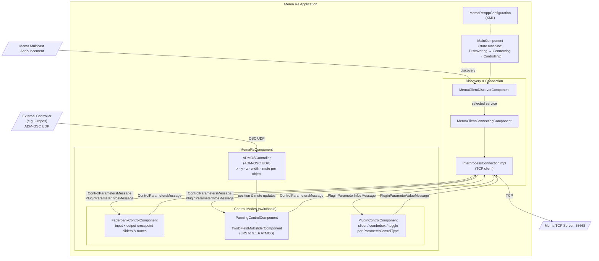
```mermaid
flowchart TD
    multicast[/"Mema Multicast Announcement"/]
    mema_srv[/"Mema TCP Server :55668"/]
    ext_ctrl[/"External Controller\n(e.g. Grapes)\nADM-OSC UDP"/]

    subgraph app["Mema.Re Application"]
        cfg["MemaReAppConfiguration\n(XML)"]
        main["MainComponent\n(state machine:\nDiscovering → Connecting → Controlling)"]

        subgraph connection["Discovery & Connection"]
            disc_comp["MemaClientDiscoverComponent"]
            conn_comp["MemaClientConnectingComponent"]
            sock["InterprocessConnectionImpl\n(TCP client)"]
        end

        subgraph remote["MemaReComponent"]
            subgraph modes["Control Modes (switchable)"]
                fader["FaderbankControlComponent\ninput x output crosspoint sliders & mutes"]
                pan["PanningControlComponent\n+ TwoDFieldMultisliderComponent\n(LRS to 9.1.6 ATMOS)"]
                plug["PluginControlComponent\nslider / combobox / toggle\nper ParameterControlType"]
            end
            admosc["ADMOSController\n(ADM-OSC UDP)\nx · y · z · width · mute per object"]
        end
    end

    multicast -->|discovery| disc_comp
    disc_comp -->|selected service| conn_comp
    conn_comp --> sock
    sock <-->|TCP| mema_srv
    sock -->|ControlParametersMessage\nPluginParameterInfosMessage| fader
    sock -->|ControlParametersMessage\nPluginParameterInfosMessage| pan
    sock -->|PluginParameterInfosMessage| plug
    fader -->|ControlParametersMessage| sock
    pan -->|ControlParametersMessage| sock
    plug -->|PluginParameterValueMessage| sock
    ext_ctrl -->|OSC UDP| admosc
    admosc -->|position & mute updates| pan
    cfg -.- main
    main --> disc_comp
```
