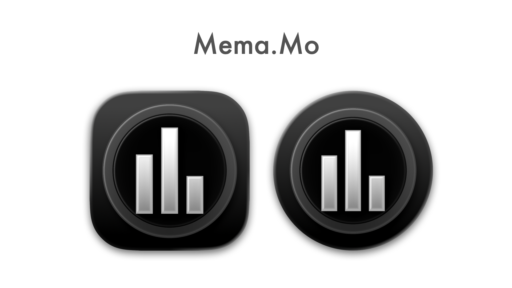
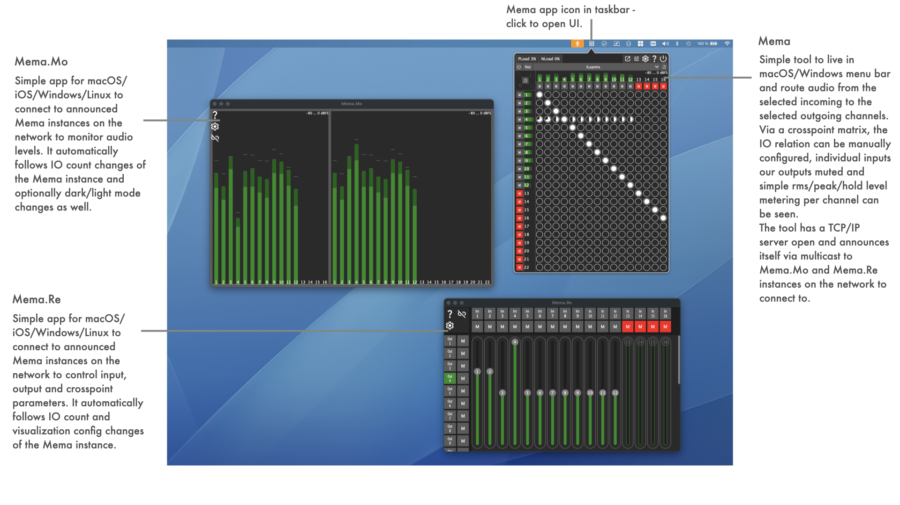
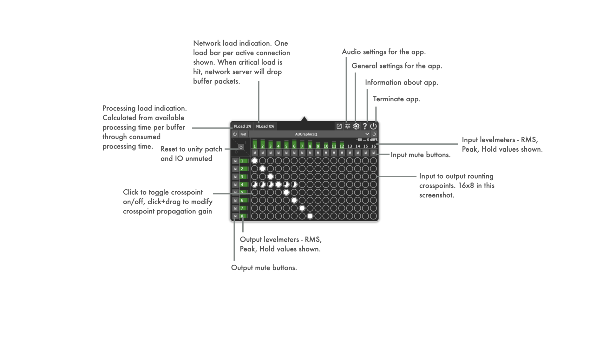
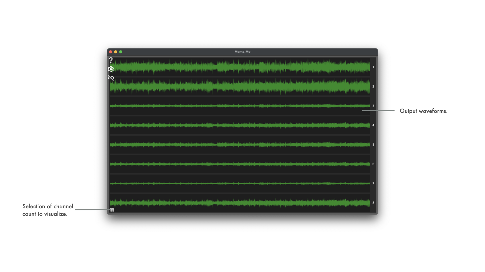
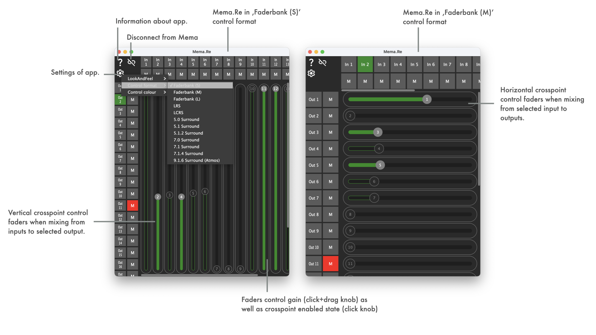
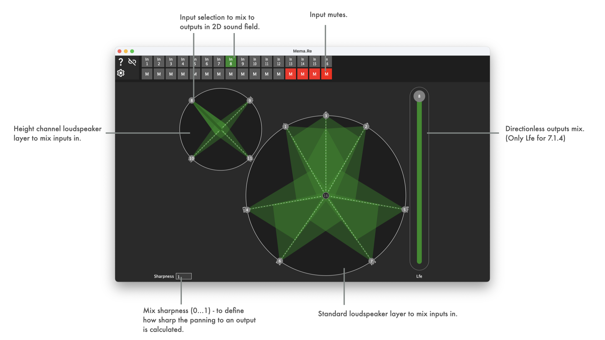

<center>



</center>

See [LATEST RELEASE](https://github.com/ChristianAhrens/Mema/releases/latest) for available binary packages or join iOS TestFlight Betas:

|Mema.Mo Testflight|Mema.Re Testflight|
|:-----------------|:-----------------|
|  |  |


|Appveyor CI build status|Mema|Mema.Mo|Mema.Re|
|:----------------|:-----|:-----|:-----|
|macOS Xcode| [](https://ci.appveyor.com/project/ChristianAhrens/mema-macos) | [](https://ci.appveyor.com/project/ChristianAhrens/memamo-macos) | [](https://ci.appveyor.com/project/ChristianAhrens/memare-macos/branch/main) |
|Windows Visual Studio| [](https://ci.appveyor.com/project/ChristianAhrens/mema-windows) | [](https://ci.appveyor.com/project/ChristianAhrens/memamo-windows) | [](https://ci.appveyor.com/project/ChristianAhrens/memare-windows/branch/main) |
|Linux makefile| [](https://ci.appveyor.com/project/ChristianAhrens/mema-linux) | [](https://ci.appveyor.com/project/ChristianAhrens/memamo-linux) | [](https://ci.appveyor.com/project/ChristianAhrens/memare-linux/branch/main) |


<a name="toc" />

## Table of contents

* [Introduction](#introduction)
  * [Mema, Mema.Mo and Mema.Re](#MemaNMoNRe)
  * [Mema UI](#MemaUI)
  * [Mema.Mo UI](#MemaMoUI)
  * [Mema.Re UI](#MemaReUI)
* [How to build the tools](#howtobuild)
  * [Mema](#buildMema)
  * [Mema.Mo](#buildMemaMo)
  * [Mema.Re](#buildMemaRe)
  * [Note on running on RaspberryPiOS Bullseye](#runonbullseye)
* [Usecase: Studio sidecar monitoring](#rackmonitoringusecase)
* [Usecase: Mobile recording monitoring](#mobilerecordingusecase)
* [App architecture](#architectureoverview)


<a name="introduction" />

## Introduction

__Mema__ (MenubarMatrix) is a project initially created to try out JUCE C++ framework capabilities for creation of a macOS menubar tool, that provides audio matrix routing functionality - e.g. to route [BlackHole](https://github.com/ExistentialAudio/BlackHole) 16ch virtual device to system output to enable flexible application and OS audio output routing to connected audio devices.

The tool has since evolved to full IO metering, IO mute and crosspoint enabled/gain processing. The UI per default can be opened from the _macOS menubar_ or _Windows notifcation area_ and can be toggled to open as a standalone permanent OS window. The appearance can be customized (coloring, dark/light mode) and the audio UI device configuration can be configured to match the usecases needs.
On top of that, dedicated performance metering is visible on the UI - regaring audio processing load as well as regarding network traffic load for data transmission to connected metering and control clients.

Optionally the loading of an audio processing plug-in is supported to process the incoming audio before or after ('Post' UI toggle) it is fed into the routing matrix. Platform dependant, the usual __VST, VST3, AU, LADSPA, LV2__ plug-in formats are supported and their respective editor user interfaces can be used as a separate window.
_A usecase for this is an n-input to m-output upmix plug-in that, in combination with e.g. BlackHole, can serve to process stereo macOS system audio output to a 7.1.4 speaker system._

It is accompanied by a separate tool __Mema.Mo__ (MenubarMatrixMonitor) to monitor the audio IO as levelmeters via network. It connects to Mema through a TCP connection and supports discovering the available instances through a multicast service announcement done by Mema.
This supports different monitoring visualizations
- IO __Meterbridge__
- Studio speaker layout __2D field__ metering: LRS up to __9.1.6 ATMOS__ layouts
- __Waveform__ plot

Also part of the project is another tool __Mema.Re__ (MenubarMatrixRemote) to remote control the input, output and crosspoint parameters of Mema instances and connects through the same TCP server as Mema.Mo.
It supports two different control approaches
- __Faderbank__ mixer (single input to multiple output or multiple input to single output style)
- __2D field__ panning: LRS up to __9.1.6 ATMOS__ layouts

The sourcecode and prebuilt binaries are made publicly available to enable interested users to experiment, extend and create own adaptations.

Use what is provided here at your own risk!

<a name="MemaNMoNRe" />

### Mema, Mema.Mo and Mema.Re



<a name="MemaUI" />

### Mema UI details



#### Mema UI plug-in handling details


<a name="MemaMoUI" />

### Mema.Mo UI details


#### Mema.Mo UI output format visualization details


#### Mema.Mo UI waveforms visualization details



#### Supported UI coloring


<a name="MemaReUI" />

### Mema.Re UI details



### Mema.Re UI 2D sound field panning details




<a name="howtobuild" />

## How to build the tools

Mema and Mema.Mo are based on JUCE C++ framework, which is a submodule of this repository.

JUCE's Projucer tool can either be used from a local installation or from within the submodule (submodules/JUCE/extras/Projucer).

<a name="buildMema" />

### Mema

[Mema Projucer project](Mema.jucer) file can be found in repository root directory.

In [macOS buildscripts](Resources/Deployment/macOS), shellscripts for automated building of the app, dmg and notarization are kept. These require a properly prepared machine to run on (signing certificates, provisioning profiles, notarization cretentials).

In [Windows buildscripts](Resources/Deployment/Windows), bash scripts for automated building of the app and installer (Innosetup based) are kept. These require a properly prepared machine to run on (innosetup installation).

In [Linux buildscripts](Resources/Deployment/Linux), shell scripts for automated building of the app are kept. These are aimed at building on Debian/Ubuntu/RaspberryPiOS and TRY to collect the required dev packages via apt packetmanager automatically.

<a name="buildMemaMo" />

### Mema.Mo

[Mema.Mo Projucer project](MemaMo/MemaMo.jucer) file can be found in /MemaMo subdirectory .

In [macOS buildscripts](Resources/Deployment/macOS), shellscripts for automated building of the app, dmg and notarization are kept. These require a properly prepared machine to run on (signing certificates, provisioning profiles, notarization cretentials).

In [iOS buildscripts](Resources/Deployment/iOS), shellscripts for automated building of the app and updloading to the appstore are kept. These require a properly prepared machine to run on (appstore cretentials).

In [Windows buildscripts](Resources/Deployment/Windows), bash scripts for automated building of the app and installer (Innosetup based) are kept. These require a properly prepared machine to run on (innosetup installation).

In [Linux buildscripts](Resources/Deployment/Linux), shell scripts for automated building of the app are kept. These are aimed at building on Debian/Ubuntu/RaspberryPiOS and TRY to collect the required dev packages via apt packetmanager automatically.

<a name="buildMemaRe" />

### Mema.Re

[Mema.Re Projucer project](MemaRe/MemaRe.jucer) file can be found in /MemaRe subdirectory .

In [macOS buildscripts](Resources/Deployment/macOS), shellscripts for automated building of the app, dmg and notarization are kept. These require a properly prepared machine to run on (signing certificates, provisioning profiles, notarization cretentials).

In [iOS buildscripts](Resources/Deployment/iOS), shellscripts for automated building of the app and updloading to the appstore are kept. These require a properly prepared machine to run on (appstore cretentials).

In [Windows buildscripts](Resources/Deployment/Windows), bash scripts for automated building of the app and installer (Innosetup based) are kept. These require a properly prepared machine to run on (innosetup installation).

In [Linux buildscripts](Resources/Deployment/Linux), shell scripts for automated building of the app are kept. These are aimed at building on Debian/Ubuntu/RaspberryPiOS and TRY to collect the required dev packages via apt packetmanager automatically.

<a name="runonbullseye" />

### Building and running Mema.Mo and Mema.Re on RaspberryPiOS Bullseye/Bookworm

The build scripts `build_MemaMo_RaspberryPIOS.sh`/`build_MemaRe_RaspberryPIOS.sh` in `Resources/Deployment/Linux` can be used on a vanilla installation of RaspberryPi OS to build the tool.

On RaspberriPi 3B it is required to run the build without graphical interface, to avoid the build failing due to going out of memory (e.g. `sudo raspi-config` -> System Options -> Boot -> Console Autologin).

The build result can be run in kind of a kiosk configuration by changing the system to not start the desktop session when running Xserver, but instead run Mema.Mo/Mema.Re directly in the X session. To do this, edit or create `.xsession` in user home and simply add a line
```
exec <PATH_TO_REPO>/Mema/MemaMo/Builds/LinuxMakefile/build/MemaMo
# or
exec <PATH_TO_REPO>/Mema/MemaRe/Builds/LinuxMakefile/build/MemaRe
```
Then configure the system to auto login to x session (e.g. `sudo raspi-config` -> System Options -> Boot -> Desktop Autologin).

___This does only work when using X server as graphics backend. Using Wayland requires differing approaches.___

<a name="rackmonitoringusecase" />

## Usecase: Studio rack monitoring


* Mema on macOS
  * BlackHole 16ch used to route signal from LogicPro, Apple Music, etc. to Mema
  * Output to Allen&Heath QU-16 22ch audio driver interface
* Mema.Mo on DIY 19" rack display, based on RaspberryPi (32bit RaspberryPiOS, Bullseye)
  * 16 audio input channel metering visible
  * 22 audio output channel metering visible


<a name="mobilerecordingusecase" />

## Usecase: Mobile recording monitoring


* Mema on macOS
  * BlackHole 16ch used to route signal from LogicPro, Apple Music, etc. to Mema
  * Output to stereo audio driver interface
* Mema.Mo on iPadOS in Stagemanager mode
  * 16 audio input channel metering visible
  * 2 audio output channel metering visible


<a name="architectureoverview" />

## App Architecture

_T.B.D._
